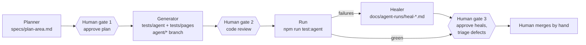

# Agent-assisted testing: Planner, Generator, Healer

Three Claude Code subagents use the Playwright MCP server to propose, write and repair tests for X-Mod Lab.
X-Mod Lab is a practice project and **not an official WCIRB tool**.

| Agent | File | Does | Never does |
|---|---|---|---|
| Planner | [`.claude/agents/xmod-test-planner.md`](../.claude/agents/xmod-test-planner.md) | Explores the running app and writes `specs/plan-<area>.md`, at least 70% negative and edge cases | Writes test code, changes the app |
| Generator | [`.claude/agents/xmod-test-generator.md`](../.claude/agents/xmod-test-generator.md) | Turns **approved** scenarios into page objects (`tests/pages/`) and tests (`tests/agent/{ui,api}/`) on a local `agent/*` branch | Invents expected values, mocks the network, pushes or merges |
| Healer | [`.claude/agents/xmod-test-healer.md`](../.claude/agents/xmod-test-healer.md) | Diagnoses failing agent tests; repairs only locator, timing and test-data problems; reports app defects | Changes an expected value, skips a test, edits the app |

## The principle: expected values come from outside the app

AI-written tests can look thorough and verify nothing when their expected values are copied from what the app
currently shows. Here, every expected value must come from one of:

- **PLAN:** a cited rule of the Experience Rating Plan.
- **HAND-CALC:** the full arithmetic, written out in the plan.
- **ORACLE:** an independent reference calculation (see *Known limits*: none exists yet).
- **CONTRACT:** the documented API error contract.
- **ASSUMPTION:** a documented interpretation.

An agent never derives an expected value from observed output. A human approves each plan, reviews the generated
code, and reviews every heal. No agent merges, pushes or deploys.

## Setup (done once)

- [`.mcp.json`](../.mcp.json) registers the Playwright MCP server (`npx @playwright/mcp@latest`). The first time the
  project is opened after this file is added, Claude Code asks you to approve the project MCP server. The tools then
  appear as `mcp__playwright__browser_navigate`, `..._snapshot`, `..._click`, `..._type`, `..._fill_form`,
  `..._select_option`, `..._press_key`, `..._resize`, `..._evaluate`, `..._network_requests`, `..._console_messages`,
  `..._take_screenshot`, `..._wait_for` and `..._close`, the names used in the agent files.
- Playwright projects in [`playwright.config.ts`](../playwright.config.ts):
  - `agent`: `tests/agent/`, Chromium, no retries, trace and screenshot on failure.
  - `seed`: [`tests/seed.spec.ts`](../tests/seed.spec.ts), which opens `/` and checks the title. It is the agents'
    starting browser state.
  - The existing `api` and `ui` projects ignore `tests/agent/`, so generated tests never run twice.
- Folders: `specs/` (plans), `tests/pages/` (page objects), `tests/agent/ui/`, `tests/agent/api/`, `docs/agent-runs/`
  (run logs, heal reports).

## How to run

1. **Start the app:** `npm start`. The agents explore `BASE_URL`, which defaults to `http://localhost:3000`.
   Never point them at the Render URL, and never use them to generate load: the rate limiter (120 calculations
   per minute per IP) would trip.
2. **Planner:** "Use xmod-test-planner on *area*. Focus on negative and edge cases." Run the areas in this order:
   1. calculate API
   2. claims table (UI)
   3. payroll and class codes (UI)
   4. exception claim types
   5. reference tables tab
   6. error handling and state
   7. security and accessibility
3. **Human gate 1:** open `specs/plan-<area>.md` and set *Human decision* on every scenario to APPROVE, REJECT or
   CHANGE (with notes). Check every *Expected source* yourself. Reject any scenario whose expected value you cannot
   verify.
4. **Generator:** "Use xmod-test-generator to implement the approved scenarios in specs/plan-*area*.md."
5. **Human gate 2:** review the diff on the `agent/*` branch with the checklist below.
6. **Healer** (only if tests fail): "Use xmod-test-healer on the failures listed in
   docs/agent-runs/generator-*date*.md."
7. **Human gate 3:** review each `heal(<ID>)` commit and each defect report, then merge by hand.

`npm run test:agent` runs only the approved agent tests (`--pass-with-no-tests`, so an empty folder passes).
In CI, the `agent-tests` job runs exactly that. **The agents themselves never run in CI.**

## Human review checklist (generated code)

- [ ] Every expected value traces to a source in the plan (PLAN, HAND-CALC, ORACLE, CONTRACT or ASSUMPTION), with
      a source comment above the assertion.
- [ ] No value is copied from the screen. Re-derive at least the numeric ones yourself.
- [ ] No mocks or route stubs (unless the plan says so for that scenario).
- [ ] No `waitForTimeout` or fixed sleeps; web-first assertions or `expect.poll` only.
- [ ] No `test.skip`, `test.fixme`, `test.fail` or `.only`.
- [ ] Locators use `getByTestId`, `getByRole` or `getByLabel` only.
- [ ] Page objects hold no assertions, apart from waiting for readiness.
- [ ] Each test title starts with its scenario ID (`AG-…`) and carries the plan's tags.
- [ ] Negative tests assert the specific error code and status, and that no result field (`mod`) comes back
      alongside an error.
- [ ] Tests are independent: their own data, no reliance on order.

Lesson from [DEF-010](DEFECTS.md): judge a run by its exit code and the reporter's statistics, never by the last
line of console output.

## Defect handling

Candidate defects from the planner and APP-DEFECT reports from the healer go into [DEFECTS.md](DEFECTS.md) in the
usual format, with **Found by: agent (planner|healer), confirmed by: *person***. An APP-DEFECT test stays red until
the defect is fixed or the human decides otherwise. It is never skipped to get a green run.

## Metrics per run

Record these in `docs/agent-runs/run-<date>-<area>.md` and summarize trends in
[TEST_PROCESS_IMPROVEMENTS.md](TEST_PROCESS_IMPROVEMENTS.md):

| Metric | Meaning |
|---|---|
| Scenarios proposed / approved / rejected / changed | Plan quality: how much a human had to remove or fix |
| Tests generated | Should equal the approved scenarios |
| First-run pass rate | Generator quality |
| Heals by classification | LOCATOR-DRIFT, TIMING, TEST-DATA, EXPECTATION-WRONG, APP-DEFECT, UNKNOWN |
| Defects found / confirmed | Value delivered |
| False alarms | Candidate defects a human rejected |

## Known limits

- **There is no independent oracle yet.** The agent files refer to `tests/e2e/oracle.json` and `tools/oracle.py`,
  and neither exists in this repo. Until one is added, the planner must use PLAN, HAND-CALC, CONTRACT or ASSUMPTION
  sources, or mark a scenario NEEDS-ORACLE.
- **Assumption IDs overlap.** The agent files call mod rounding "A1" and whole-dollar rounding "A2". In this repo,
  those are assumptions 1 and 2 of `RatingPolicy` (README and [TEST_STRATEGY.md](TEST_STRATEGY.md) §6). In
  [ENGINE_PERIOD_RULES.md](ENGINE_PERIOD_RULES.md), A1–A6 are the *experience-period* assumptions, a different list.
  When reviewing a plan, check which one a citation means.
- **Agents can misread the Plan.** A hand-calc in a plan is a claim to check, not proof.
- **An oracle can share its author's blind spots**, whoever writes it: person or agent.
- **Agents don't replace exploratory testing by a person.**
